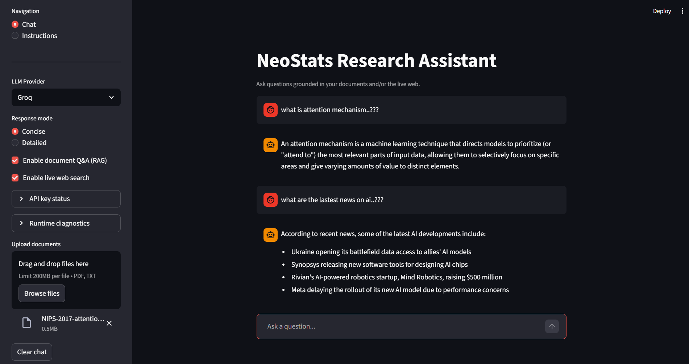

# NeoStats Research Assistant

A production-ready AI research assistant built with Streamlit. The application answers questions by combining retrieval-augmented generation (RAG) over uploaded documents with live web search, powered by your choice of LLM provider.

---

## Overview

The assistant addresses a common limitation of general-purpose language models: their inability to reason over private documents or access recent information. By integrating a FAISS-backed document retrieval pipeline with the Tavily search API, the chatbot grounds its responses in evidence — either from your files or from the live web — before generating an answer.

---

## Live Demo

[https://neostats-research-assistant.streamlit.app/](https://neostats-research-assistant.streamlit.app/)

[](https://neostats-research-assistant.streamlit.app/)

---

## Features

**Document Q&A (RAG)**
Upload PDF or TXT files. The pipeline automatically chunks, embeds, and indexes them into an in-memory FAISS vector store. At query time, the most relevant chunks are retrieved and injected into the model context.

**Live Web Search**
Toggle Tavily-powered web search from the sidebar. When enabled, the top results (title, URL, snippet) are appended to the prompt, keeping answers current beyond the model's training cutoff.

**Multi-Provider LLM Support**
Switch between Groq, OpenAI, and Google Gemini directly from the sidebar. Each provider is encapsulated in `models/llm.py` with a consistent interface.

**Response Modes**
Select between Concise (2–3 sentence summaries) and Detailed (structured, example-rich explanations) to match the depth of answer you need.

---

## Architecture

```
User Query
    │
    ▼
Streamlit Chat UI
    │
    ▼
Query Router
 ├── Document Retrieval (FAISS)
 │       └── Relevant Context Chunks
 │
 └── Tavily Web Search
         └── Search Results
                │
                ▼
         LLM (Groq / OpenAI / Gemini)
                │
                ▼
         Generated Response
```

---

## Project Structure

```
project/
├── config/
│   └── config.py          # API keys and global settings
├── models/
│   ├── llm.py             # LLM provider wrappers
│   └── embeddings.py      # Sentence-transformer embedding model
├── utils/
│   ├── rag_utils.py       # Document loading, chunking, vector store
│   └── search_utils.py    # Tavily web search integration
├── assets/
│   └── demo.png
├── app.py                 # Streamlit UI and page routing
├── requirements.txt
└── README.md
```

---

## Requirements

- Python 3.12 or higher
- At least one LLM API key (Groq, OpenAI, or Google Gemini)
- Tavily API key (optional, required only for web search)

---

## Installation

**Using pip**

```bash
pip install -r requirements.txt
streamlit run app.py
```

**Using uv (recommended)**

```bash
uv sync
uv run streamlit run app.py
```

---

## Configuration

Create a `.env` file in the project root:

```env
GROQ_API_KEY=your_groq_key
OPENAI_API_KEY=your_openai_key
GOOGLE_API_KEY=your_google_key
TAVILY_API_KEY=your_tavily_key
```

Optional overrides:

```env
DEFAULT_GROQ_MODEL=llama-3.1-8b-instant
CHUNK_SIZE=500
CHUNK_OVERLAP=50
```

> Do not commit `.env` to version control. Add it to `.gitignore`.

---

## Usage

1. Start the application:

```bash
streamlit run app.py
```

2. In the sidebar, select an LLM provider, choose a response mode, and optionally upload documents or enable web search.

3. Type your question in the chat input. The assistant will retrieve relevant context and generate a grounded response.

---

## Error Handling

All external calls — LLM inference, embeddings, vector store operations, and web search — are wrapped in `try/except` blocks. Errors are surfaced as Streamlit UI alerts rather than silent failures or stack traces. API keys are read exclusively from environment variables and are never hardcoded.

---

## Tech Stack

| Layer | Technology |
|---|---|
| UI | Streamlit |
| LLM providers | Groq, OpenAI, Google Gemini |
| Embeddings | Sentence Transformers (`all-MiniLM-L6-v2`) |
| Vector store | FAISS |
| RAG pipeline | LangChain Community |
| Web search | Tavily API |

---


